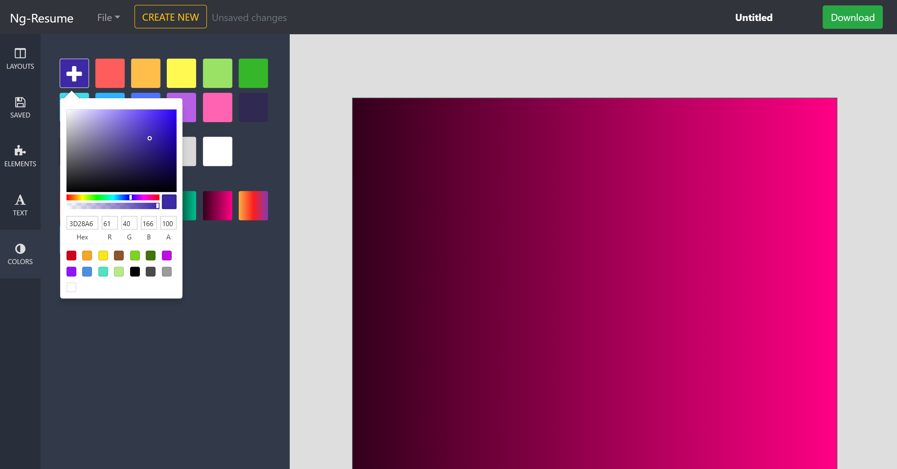
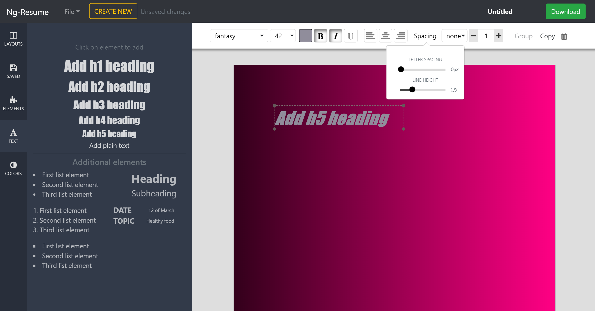
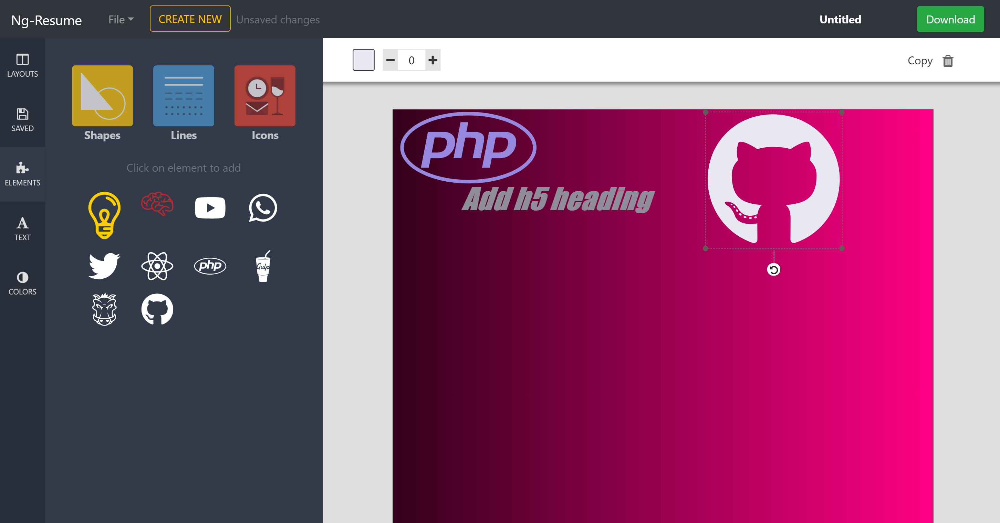
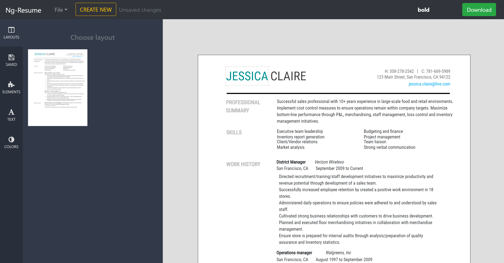

# ResumeBuilder

The project is built using Angular 5, RxJS, Bootstrap and other libraries.

For live demo please visit the following link: https://pavelpleshko.github.io/

This application allows user to create,edit and export in pdf format single page documents.

## Changing background color.
Here user can play with background color of the document. Pallete contains some predefined colors and gradients. U?ser is free to add new colors to existing and apply it to the document.

## Adding text elements.
User can add html elements to the document. Among them are various lists,h1-h5 elements,paragraph(p element) and presets which can be manipulated in many ways such as rotation,resizing,translation,changing styles as shown below.

## Adding svg elements.
Application also allows users to add different kinds of svg elements such as lines, shapes(hearts,triangles,circles etc) and icons. These svg elements and their parts can be manipulated with(changing color,size,coordinates).

## Adding template.
This application makes it possible to add preexisting template to the current document which makes everything easier and faster.

## Exporting document.
Finally, user can export the current document he is working on in PDF format.
